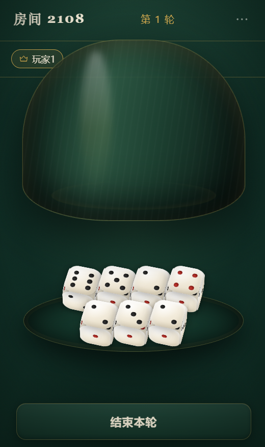

# 🎲 骰盅游戏 (Dice Cup Game)

一个基于 WebSocket 的实时多人在线骰盅游戏，支持房间管理、多轮投掷、幸运嘉宾机制等功能。

## 📸 演示效果

<div align="center">
  
  <p><em>骰盅游戏界面</em></p>
</div>

## ✨ 特性

- 🎮 **实时多人对战** - 基于 WebSocket 的低延迟实时通信
- 🏠 **房间系统** - 支持创建/加入房间，房主控制游戏流程
- 🎲 **骰盅动画** - 流畅的摇晃动画和掀盅交互
- ✨ **幸运嘉宾** - 房主可秘密指定幸运玩家，修改其点数
- 📊 **统计面板** - 实时展示各玩家投掷结果和点数统计
- 🔄 **断线重连** - 刷新页面自动恢复游戏状态
- 📱 **响应式设计** - 支持桌面和移动端

## 🛠️ 技术栈

### 前端
- Vue 3 + TypeScript + Pinia
- GSAP 动画
- WebSocket 实时通信

### 后端
- FastAPI + Python 3.10+
- WebSocket 实时推送

## 📦 本地开发

### 前置要求
- Node.js 18+
- Python 3.10+

### 后端启动

```bash
cd backend
pip install -r requirements.txt
python -m uvicorn main:app --host 127.0.0.1 --port 8000
```

### 前端启动

```bash
cd frontend
npm install
npm run dev
```

访问 `http://localhost:5173` 开始游戏。

## 🚀 部署

### Docker 部署（推荐）

项目已配置 Dockerfile，可直接部署到支持 Docker 的平台（创空间、Hugging Face Spaces 等）：

```bash
# 构建前端
cd frontend && npm run build && cd ..

# 构建镜像
docker build -t playing-dice .

# 运行容器
docker run -p 7860:7860 playing-dice
```

访问 `http://localhost:7860`

### 创空间/云平台

将项目推送到 GitHub，在创空间选择 Docker SDK 自动部署。

## 📁 项目结构

```
.
├── backend/              # 后端代码
│   ├── main.py          # FastAPI 入口
│   ├── game.py          # 游戏逻辑
│   ├── room.py          # 房间管理
│   ├── manager.py       # WebSocket 管理
│   └── protocol.py      # 协议定义
├── frontend/            # 前端代码
│   ├── src/             # 源代码
│   └── dist/            # 构建产物
├── app.py               # 应用入口
├── Dockerfile           # Docker 配置
├── requirements.txt     # Python 依赖
└── README.md
```

## 📄 许可证

MIT License

